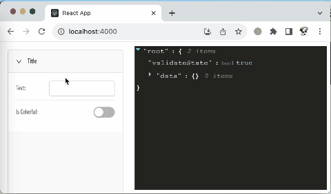

# sisyphus.hall
A Dynamic Form Definition Language in Javascript

一个利用Javascript语言实现的动态表单定义语言

## Usage (用法)
```javascript
import { generator, types as t } from 'sisyphus.hall';
import _ from 'lodash';

const Form = generator("Form1", [
    ['properties', [
        ['text', t.text().maxLength(1).placeholder('please input text')],
        [t.separator()],
        ['isColorful', t.toggle()],
        [t._if('isColorful')
            .then([
                ['color', t.color().defaultValue('#F00')],
            ])
        ],
    ]
]);

React.render(<Form />, document.getElementById('root'));
```

The code above can generate a form like the one below

可以生成一个类似于下图的表单

